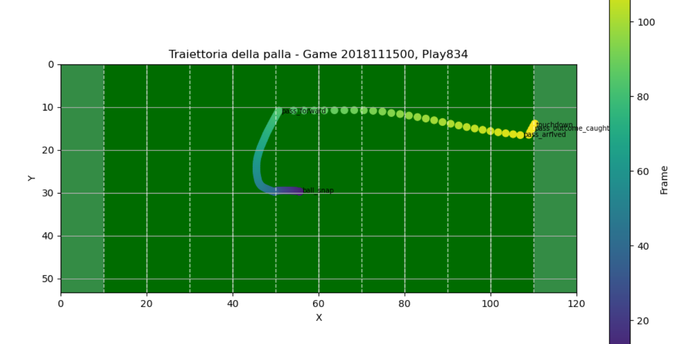
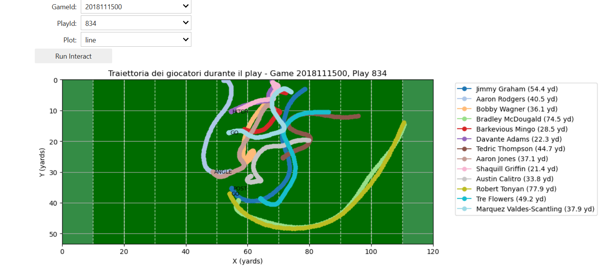
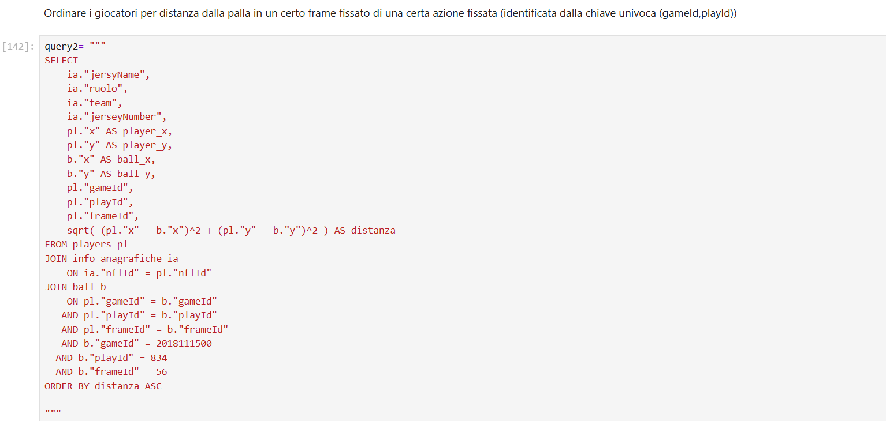
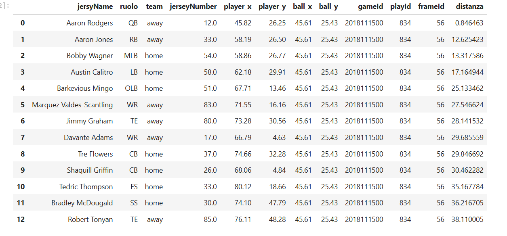

## Project overwiew
The goal of this project is to become familiar with a sports tracking dataset from the National Football League (NFL) and explore the information it contains through Exploratory Data Analysis (EDA).

The project focuses on understanding the structure of the dataset, investigating player tracking identifiers and their role in linking observations across frames, and extracting meaningful insights through statistical analysis and data visualization.

The analysis is conducted using Python and Jupyter Notebook, with a particular focus on player movements, positional roles, and game dynamics.
## Dataset
The dataset contains NFL player tracking data, recording player-level information across multiple frames during football plays.

Tracking identifiers such as `gameId`, `playId`, `frameId`, and `nflId` are used to identify games, plays, individual frames, and players, respectively. These identifiers make it possible to organize tracking observations and reconstruct player movements over time.

## Exploratory Data Analysis
The EDA focuses on understanding the dataset and exploring relevant patterns through descriptive statistics and visualizations.

The main activities include:
- Exploring the dataset structure, variables, and data types.
- Investigating player and positional role distributions.
- Analyzing tracking data and player movement patterns.
- Creating visualizations to highlight relevant features and relationships.
  
## Selected Visualizations

The following visualizations illustrate some of the main findings and analytical steps developed throughout the notebook.

Example of player tracking data visualization.

Ball trajectory during a play

Trajectories of the players involved in the play.

Exploratory analysis of player-related features.

Gaussian density distributions fitted to the mean y-coordinate (`y_mean`) of NFL players, grouped by positional role.
## Database Integration and SQL Queries
The project also explores the integration of the tracking data into a relational database, enabling structured data storage and retrieval through SQL queries.

This step provides an opportunity to investigate how tracking data can be organized into a database and queried to extract relevant information.
## Example SQL Query
Example of a SQL query used to retrieve information from the database.

## Query Output
Result returned by the query.

## Repository Structure
- `jupyter notebook/` : Jupyter Notebook containing the exploratory data analysis.
- `images/` : Selected visualizations and screenshots included in this README.
## How to Explore the Project
The complete analysis is available in the Jupyter Notebook included in this repository (in italian). You can browse the notebook directly on GitHub to review the code, visualizations, and analytical process.
